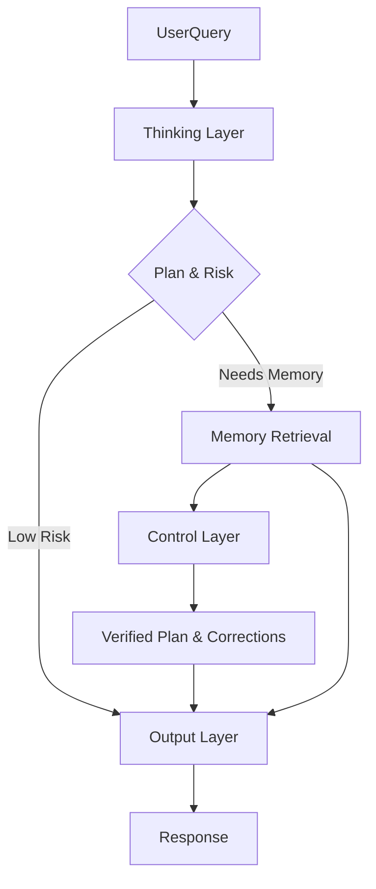

# Core Layers

The cognitive architecture of the assistant is divided into three distinct layers, each enabling "System 2 Thinking" capabilities by separating planning, verification, and articulation.

## Overview

## Layer 1: Thinking (`thinking.py`)

**The Strategist.**

This layer analyzes the user's request **before** attempting to answer. It does not generate the final text but instead produces a structured JSON plan.

- **Model**: `deepseek-r1:8b` (Reasoning optimized)
- **Functions**:
    - `analyze_stream`: Streams the "thought process" so the user sees the AI thinking in real-time.
    - `_extract_plan`: Parses the structured JSON outcome from the reasoning model.
- **Output Plan**:
    - `intent`: What does the user want?
    - `needs_memory`: Do we need to look up facts?
    - `hallucination_risk`: Is this a dangerous topic to guess on?
    - `suggested_response_style`: How should we reply?

## Layer 2: Control (`control.py`)

**The Critic.**

This layer acts as a safety mechanism. It takes the plan from the Thinking Layer and the facts retrieved from Memory, then verifies if the plan is sound.

- **Model**: `qwen3:4b` (Efficient & Precise)
- **Functions**:
    - `verify`: Checks if the plan matches the retrieved memory.
    - `apply_corrections`: Modifies the plan if the Critic finds issues (e.g., "Don't guess the age, we didn't find it in memory").
- **Constraint Enforcement**: Ensures the assistant doesn't answer questions it shouldn't or hallucinate facts when memory lookup failed.

## Layer 3: Output (`output.py`)

**The Speaker.**

This layer generates the final natural language response for the user. It is purely an execution layer; it follows the instructions from the previous layers.

- **Model**: `llama3.1:8b` (Creative & Natural)
- **Functions**:
    - `_build_full_prompt`: Assembles the final prompt using the Persona, the Control Layer's instructions, and the Memory context.
    - `generate_stream`: Streams the final answer token-by-token.
- **Features**:
    - **Persona Application**: Injects the assistant's personality (defined in `persona.py`).
    - **Anti-Hallucination**: If instructed by the Control Layer, it will explicitly refuse to guess missing information.

## Usage

These layers are orchestrated by the `CoreBridge` in `../bridge.py`. They typically aren't called directly by external modules but work in concert to process a `CoreChatRequest`.
